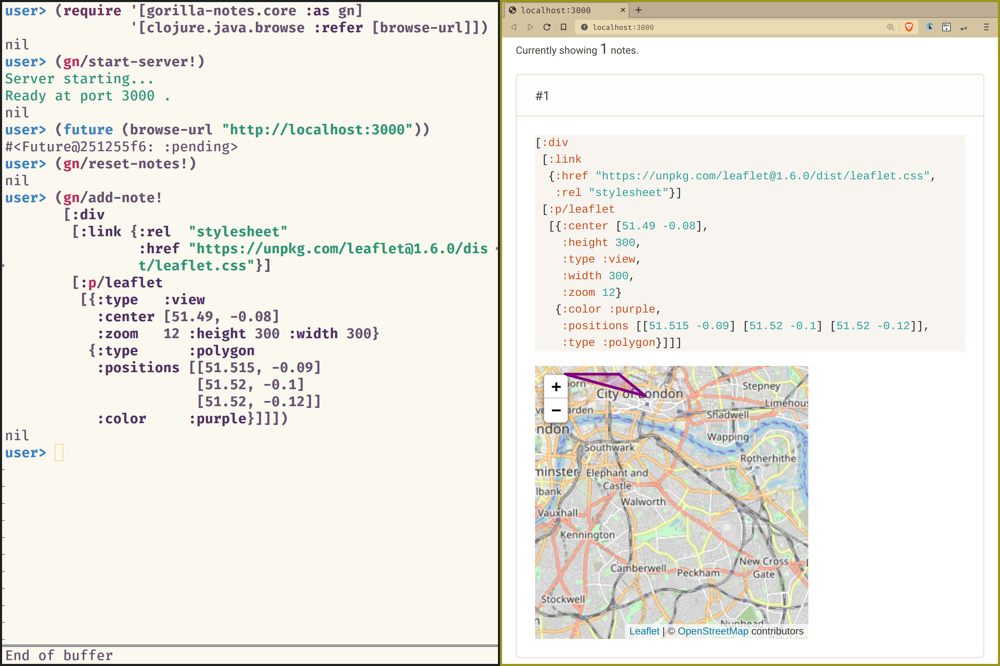

# gorilla-notes

This small library is an experiment with a basic Clojure REPL workflow for creating visual notes (code + html result).

We render the notes using [gorilla-ui](https://github.com/pink-gorilla/gorilla-ui). Gorilla-ui is a Clojure library used in [pink-gorilla](https://pink-gorilla.github.io) for rendering visual elements using an superset of the [Hiccup format](https://github.com/weavejester/hiccup). It offers declarative Hiccup-like wrappers for various Javascript visualization libraries.

Eventually, some of the attempts here might be merged in to [Notespace](https://github.com/scicloj/notespace).

## Screenshot

## Usage
See [using-gorilla-notes](https://github.com/daslu/using-gorilla-notes).

## Building and installing

- `npm install`
- `shadow-cljs compile app`
- `lein install`

## Live development and exploration

- `npm install`
- `shadow-cljs watch app`
- open a Clojure (JVM) REPL and connect your favourite editor
- play with both the Clojure and the Clojurescript code

## License

Copyright © 2020 Scicloj

This program and the accompanying materials are made available under the
terms of the Eclipse Public License 2.0 which is available at
http://www.eclipse.org/legal/epl-2.0.

This Source Code may also be made available under the following Secondary
Licenses when the conditions for such availability set forth in the Eclipse
Public License, v. 2.0 are satisfied: GNU General Public License as published by
the Free Software Foundation, either version 2 of the License, or (at your
option) any later version, with the GNU Classpath Exception which is available
at https://www.gnu.org/software/classpath/license.html.
